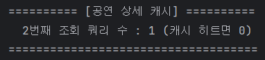
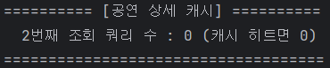
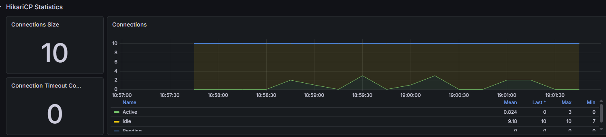
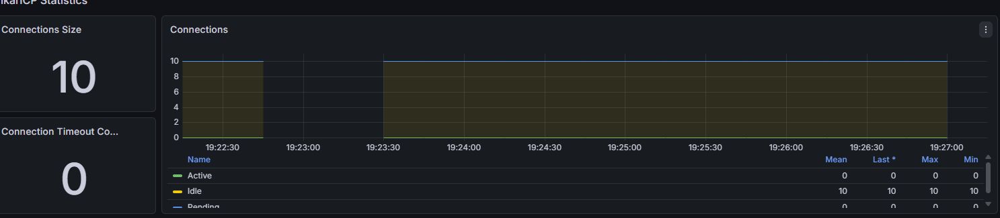

# 빠른 PK 조회에도 캐시를 적용한 이유

## 문제

공연 상세는 PK 단건 조회라 한가할 때는 캐시 없이도 충분히 빨랐다. 하지만 인기 공연 하나에 조회가 집중되는 상황에서는 같은 데이터가 요청마다 DB까지 전달됐다. 캐시의 목표를 단건 속도 개선보다 **반복 조회의 DB 도달 차단과 처리량 확보**로 정했다.

## 구현

- 공연 상세 응답을 Redis Cache에 저장한다.
- 공연 수정·검수 상태 변경 시 관련 키를 제거한다.
- 좌석 상태는 실시간성이 중요하므로 캐시 대상에서 제외한다.
- 캐시 워밍 후 동일 공연을 반복 조회하는 조건으로 전후를 비교했다.

## 기능 검증

두 번째 조회의 DB 쿼리가 `1 → 0`으로 줄어 캐시 hit를 확인했다.

| Before | After |
|---|---|
|  |  |

## 부하 테스트 결과

| 지표 | 캐시 전 | 캐시 후 |
|---|---:|---:|
| p95 | 268ms | **101ms** |
| 중앙값 | 124ms | **38ms** |
| 처리량 | 616 TPS | **1,660 TPS** |
| HikariCP Active | 최대 3 | **0** |

| Before | After |
|---|---|
|  |  |

캐시 전에도 Active가 높지는 않았다. 따라서 “커넥션 경쟁을 해소했다”가 아니라, **반복 조회가 DB에 도달하지 않았고 그 결과 처리량이 증가했다**고 해석했다.

## 트레이드오프

- 읽기 부하는 줄지만 수정 시 무효화 책임이 생긴다.
- 좌석처럼 자주 변하는 데이터까지 캐시하면 오래된 상태를 보여줄 수 있어 대상에서 제외했다.
- Redis 장애 시 공연 조회가 함께 실패하지 않도록 캐시 장애 정책을 별도로 고려해야 한다.

[기술 문서 목록](README.md)
