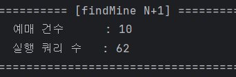
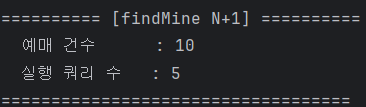
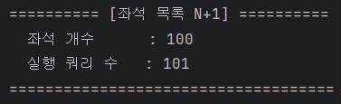
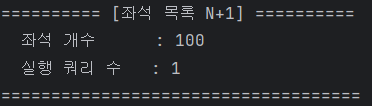

# 연관관계 조회를 줄이자 처리량이 두 배가 됐다

## 문제

내 예매 목록은 예매뿐 아니라 공연, 회차, 공연장과 좌석 정보를 함께 응답한다. LAZY 연관관계를 DTO 변환 과정에서 순서대로 접근하면서 예매 10건 조회에 62개의 SQL이 실행됐다. 좌석 목록 역시 판매 좌석 100건을 조회한 뒤 물리 좌석을 건별 조회해 101개의 SQL이 발생했다.

## 해결

- 페이징을 유지해야 하는 `ToOne` 연관관계는 QueryDSL fetch join으로 가져왔다.
- 컬렉션 fetch join은 메모리 페이징 위험이 있어 사용하지 않고 Hibernate batch fetch로 `IN` 조회했다.
- 좌석 목록은 `EventSeat → Seat` 단일 연관관계를 fetch join했다.
- Hibernate Statistics 기반 테스트로 쿼리 수 상한을 고정했다.

## 쿼리 수 검증

### 내 예매 목록

| 변경 전 | 변경 후 |
|---:|---:|
| 10건 조회, **62 queries** | 10건 조회, **5 queries** |

| Before | After |
|---|---|
|  |  |

### 좌석 목록

| 변경 전 | 변경 후 |
|---:|---:|
| 100석 조회, **101 queries** | 100석 조회, **1 query** |

| Before | After |
|---|---|
|  |  |

## 부하 테스트

`findMine`은 100 VU에서 p95가 `2.02s → 797ms`, 처리량이 `83 → 167 TPS`로 개선됐다. 300 VU에서도 p95 `5.37s → 2.33s`, 처리량 `103 → 153 TPS`를 기록했다. 쿼리 수 감소가 저부하의 단건 응답뿐 아니라 포화 구간의 처리 효율에도 영향을 준 것을 확인했다.

## 선택의 이유

컬렉션까지 fetch join하면 한 SQL로 보일 수 있지만, `OneToMany`와 페이징을 함께 사용할 경우 중복 행과 메모리 페이징 문제가 생긴다. 쿼리 한 개라는 숫자보다 페이징의 안정성을 우선해 `ToOne fetch join + collection batch fetch`로 나눴다.

## 관련 코드와 테스트

- `ReservationRepositoryImpl`
- `EventSeatRepository`
- `ReservationQueryCountTest`
- `EventSeatQueryCountTest`

[기술 문서 목록](README.md)
