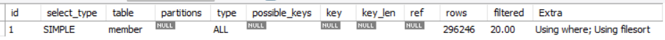
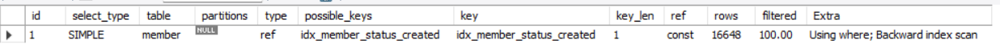
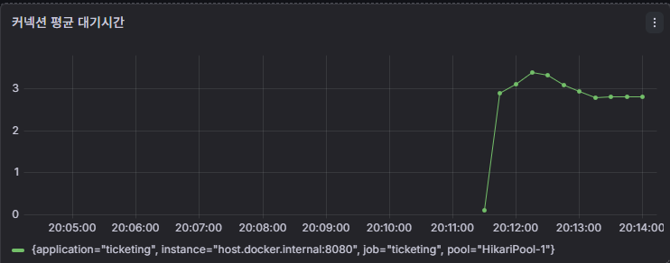

# 31초의 회원 검색 지연, 병목을 추적해 746ms까지 줄이다

## 측정 조건과 원칙

회원 약 30만 건, 100 VU, 3분, HikariCP Pool 10, 동일 검색 조건에서 변경 요소를 하나씩 적용했다. 실행계획은 `EXPLAIN ANALYZE`, 요청 지표는 k6, 커넥션 상태는 Grafana, ORM 조회 범위는 Hibernate Statistics와 실제 실행 SQL로 나누어 확인했다.

```text
문제 재현 → 병목 가설 → 한 가지 변경 → 동일 조건 재측정 → 다음 병목 확인
```

## 1. Full Scan과 Filesort 제거

관리자 회원 검색은 `member_status`로 필터링하고 `created_at DESC`로 정렬한다. 인덱스 적용 전에는 약 29만 행을 확인하고 filesort를 수행했다. 조회와 정렬 순서를 함께 지원하도록 `(member_status, created_at)` 복합 인덱스를 적용했다.

| 적용 전 | 적용 후 |
|---|---|
|  |  |

| 지표 | 인덱스 적용 전 | 인덱스 적용 후 |
|---|---:|---:|
| `EXPLAIN ANALYZE` 실행 시간 | 877ms | **33ms** |
| API p95 | 31.84s | **7.00s** |
| 처리량 | 3.60 TPS | **15.15 TPS** |

SQL 병목은 줄었지만 API p95 7초가 남았다. 단독 SQL 실행시간의 감소를 전체 요청의 해결로 판단하지 않고 부하 구간의 다음 병목을 확인했다.

## 2. 커넥션 풀 부족 가설 검증

부하 구간에서 HikariCP Pool 10개가 모두 사용되고 Pending이 최대 90까지 증가했다. 커넥션 부족이 지연의 원인이라고 가정하고 Pool을 30으로 확대한 뒤 같은 조건으로 다시 측정했다.



| 지표 | Pool 10 | Pool 30 |
|---|---:|---:|
| API p95 | 7.00s | **9.65s** |
| 처리량 | 15.15 TPS | **15.34 TPS** |
| Pending 최대 | 90 | **70** |

Pending은 일부 감소했지만 30개의 커넥션도 모두 사용됐고 처리량은 거의 증가하지 않았다. p95도 악화되어 Pool 확대를 원복했다. 커넥션 대기는 지연의 전부가 아니라, 커넥션을 점유하는 작업이 느려지면서 함께 나타난 결과라고 판단했다.

## 3. JOINED 전체 엔티티 조회 발견

Pool 확대가 효과가 없어 커넥션 획득 이후 실행되는 SQL과 엔티티 조회 범위를 다시 확인했다. 관리자 목록 응답에는 7개 필드만 필요했지만, `Member`의 `JOINED` 상속 구조 때문에 하위 회원 테이블과 전체 엔티티 필드를 함께 조회하고 있었다.

```text
Before: Member Entity 조회 → AdminMember·NormalMember·Seller JOIN → 전체 필드 로딩
After : Member 단일 조회 → 필요한 7개 필드 SELECT → MemberSearchResult 직접 생성
```

부하 중 해당 엔티티 검색 SQL은 평균 약 550ms까지 증가했다. QueryDSL DTO Projection을 적용해 다음 필드만 직접 조회하도록 변경했다.

```text
id · email · name · phone · memberType · memberStatus · createdAt
```

Projection 회귀 테스트에서는 검색 결과를 반환하면서 `Member` 엔티티 로딩 수가 0인지 Hibernate Statistics로 검증했다.

## 4. 최종 검증

| 지표 | Entity 전체 조회 | DTO Projection |
|---|---:|---:|
| 부하 중 검색 SQL 평균 | 약 550ms | **약 0.76ms** |
| API p95 | 7.00s | **746ms** |
| 처리량 | 15.15 TPS | **211.63 TPS** |
| HikariCP Pool | 10 | **10** |

복합 인덱스로 검색과 정렬 비용을 줄이고, DTO Projection으로 ORM 조회 범위와 커넥션 점유 시간을 줄였다. 효과가 없었던 Pool 확대는 유지하지 않았다.

## 함께 확인한 다른 성능 개선

### 내 예매 목록 N+1

| 항목 | 변경 전 | 변경 후 |
|---|---:|---:|
| 쿼리 수 | 62 | **5** |
| k6 p95 | 2.02s | **797ms** |
| 처리량 | 83 TPS | **167 TPS** |

ToOne 연관관계는 QueryDSL fetch join으로 조회하고, 컬렉션은 페이징 안정성을 위해 batch fetch로 분리했다. 자세한 선택 근거는 [N+1 문서](n-plus-one.md)에 정리했다.

### 공연 상세 캐시

| 항목 | 캐시 전 | 캐시 후 |
|---|---:|---:|
| p95 | 268ms | **101ms** |
| 처리량 | 616 TPS | **1,660 TPS** |
| 반복 요청 DB 접근 | 발생 | **0** |

단건 PK 조회 속도보다 반복 조회가 DB에 도달하지 않도록 부하를 흡수하는 목적으로 적용했다. 캐시 무효화와 검증 결과는 [캐시 문서](cache-performance.md)에 정리했다.

## 관련 코드와 테스트

- [MemberRepositoryImpl](../../src/main/java/com/ticketing/member/repository/MemberRepositoryImpl.java)
- [MemberSearchResult](../../src/main/java/com/ticketing/member/dto/response/MemberSearchResult.java)
- [DTO Projection 테스트](../../src/test/java/com/ticketing/admin/service/AdminMemberSearchProjectionTest.java)
- [회원 검색 k6 스크립트](../../k6/member-search.js)
- [ReservationRepositoryImpl](../../src/main/java/com/ticketing/reservation/repository/ReservationRepositoryImpl.java)
- [예매 목록 쿼리 수 테스트](../../src/test/java/com/ticketing/reservation/ReservationQueryCountTest.java)
- [공연 캐시 테스트](../../src/test/java/com/ticketing/event/service/EventCacheTest.java)

[기술 문서 목록](README.md)
